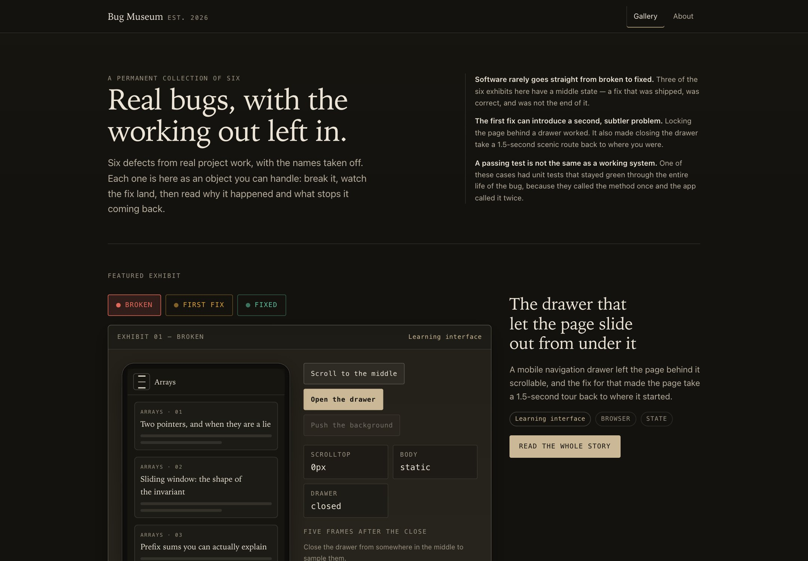
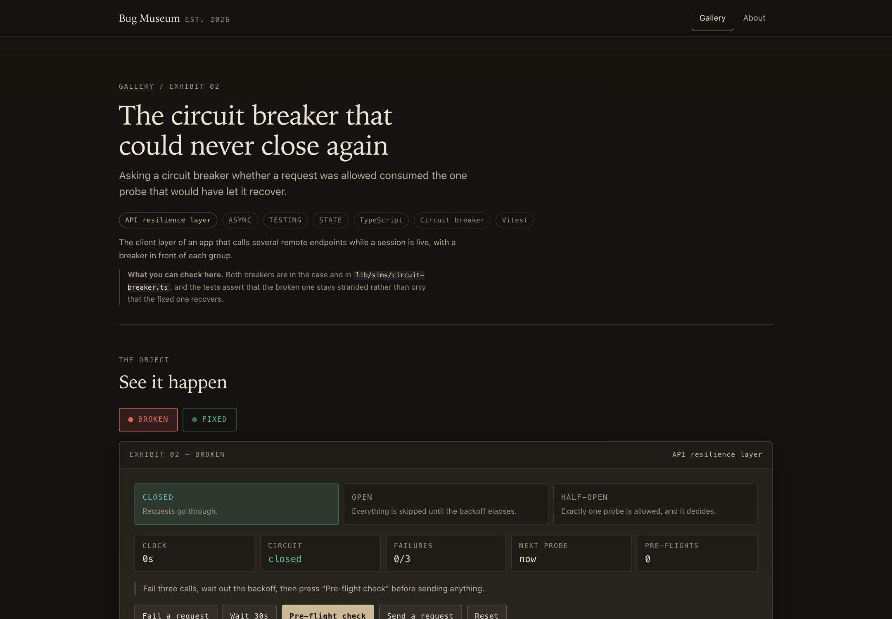

# Bug Museum

An interactive museum of six anonymised debugging cases. Each exhibit lets you
reproduce the broken behaviour, switch to the fix, read why it happened, and run
the test that keeps it from coming back.

Based on bugs encountered during real project work. Identifying project details
have been changed, and each behaviour is reproduced here as a deterministic
simulation.

Live: <https://bugmuseum.vercel.app>



*The gallery. Every exhibit is an object you can handle: switch it between broken, first fix and fixed, and watch the state readouts change with it.*



*Inside an exhibit — reproduce the defect, step through what the fix changes, and read why the first attempt was not the end of it.*

## Why it exists

The fix for a bug is easy to show. The reasoning is not, and the reasoning is
the part that matters when you are deciding whether someone can debug.

So this is not a debugging tutorial and it contains no invented incidents. It
is a collection of things that actually went wrong in code I wrote, presented
with the working out left in — including the fixes that were correct and turned
out not to be the end of it. Three of the six have a middle state for exactly
that reason.

The projects those defects came from are not named. The technical setting is
what a reader needs; the product name explains nothing, some of the software is
still in use, and a museum of its past defects is not a fair way to represent
it. Each exhibit is labelled by its setting instead.

## What is real, what is modelled, what is tested

**Real**

- The debugging cases: the defect, the root cause, the order the fixes happened
  in, and why the first one was not enough.
- The tests. Every regression test an exhibit links to is a test in this
  repository, and every excerpt marked *from this repository* is copied from the
  file it links to.

**Modelled**

- Every demonstration. Nothing here talks to a server, a microphone or a model
  API. Each simulation re-implements the mechanism so you can drive it.
- Every code excerpt marked *minimal reproduction*: written for this museum to
  show the pattern, not quoted from anyone's source.
- The content inside the simulations — page titles, drill names, the three
  fill-in-the-blanks.
- The clocks. Time zones, backoffs and 180ms ticks are modelled
  deterministically so the exhibits behave identically for every visitor and on
  every test runner.

**Where the evidence is thinner**

Exhibit 04 is modelled rather than driven in a real browser: the API it depends
on does not exist in a Node test environment, so its loop is reproduced as a
deterministic state machine. Its exhibit page says so in the section where the
test would otherwise be, rather than implying end-to-end coverage it does not
have.

Every display case also carries a note explaining what it reproduces rather than
runs, including where a delay was shortened to keep the demonstration bearable.
`/about` states the evidence standard in full.

## The collection

| № | Exhibit | Setting | States |
|---|---------|---------|--------|
| 01 | The drawer that let the page slide out from under it | Learning interface | Broken · First fix · Fixed |
| 02 | The circuit breaker that could never close again | API resilience layer | Broken · Fixed |
| 03 | The day that was only 23 hours long | Daily practice tracker | Broken · First fix · Fixed |
| 04 | The effect that stopped what it had just started | Voice session | Broken · Fixed |
| 05 | The other tab brought the account back | Multi-tab account flow | Broken · First fix · Fixed |
| 06 | Two presses of Enter, one question you never saw | Guided coding exercise | Broken · Fixed |

The settings are descriptions, not products. None of them is the name of an
application.

## Architecture

```
app/                    routes: gallery, /exhibits/[slug], /about, icon, OG image
components/museum/      reusable furniture — cards, cases, code, timeline, sources
components/sims/        one folder per simulation, each a client component
content/schema.ts       the exhibit model and its validator
content/exhibits/       one file per exhibit, plus the gallery order
lib/sims/               the logic each simulation runs, framework-free and tested
styles/                 tokens.css, base.css, layout.css; everything else is a CSS Module
tests/unit/             Vitest — data validation, simulation logic, components
tests/e2e/              Playwright — against `next start`, never the dev server
```

Everything is statically rendered at build time. There is no database, no API
route and no client-side data fetching; the only JavaScript that ships is the
simulations and the gallery filter.

Content and presentation are deliberately separate: `content/` knows nothing
about React, `components/museum/` knows nothing about any particular bug, and
`lib/sims/` knows nothing about the DOM.

## The exhibit data model

An exhibit is one object, defined in [`content/schema.ts`](content/schema.ts):

```ts
interface Exhibit {
  slug: string;
  number: number;               // gallery number, 1-based
  title: string;
  summary: string;              // exactly one sentence
  context: ExhibitContext;      // { label, description } — see below
  categories: Category[];       // state | async | browser | concurrency | testing
  tech: string[];
  simulation: SimulationId;     // key into components/sims/registry.tsx
  states: ExhibitStateCard[];   // starts with broken, ends with fixed
  whatHappened: string[];
  rootCause: string[];
  whyFirstFixFailed?: string[]; // required exactly when a first-fix state exists
  test: RegressionTest;         // prose + one excerpt
  excerpts: CodeExcerpt[];      // each marked "reproduction" or "museum-source"
  timeline: TimelineEntry[];    // observed → first fix → final fix → test
  sources: SourceLink[];        // artifacts in this repository only
  evidence: string;             // one line: what you can check here
  simulationNote: string;       // what is reproduced rather than run
}
```

`ExhibitContext` carries no project identity. Its `label` must be one of six
fixed technical descriptions, and `description` is one sentence about the kind of
software the case happened in. There is no field holding a project name, and no
hidden one either.

`SourceLink.kind` names an artifact in this repository — `exhibit-definition`,
`simulation`, `simulation-logic`, `regression-test`, `commit` — and every
exhibit must supply at least its definition, its simulation and its test.

`CodeExcerpt.origin` is the honest half of the model:

- `"reproduction"` — a minimal rewrite of the pattern, written here. Rendered as
  *minimal reproduction*, with no source link, because there is nothing to link.
- `"museum-source"` — copied from a file in this repository, which it must link
  to. Rendered as *from this repository*.

### Validation

`validateExhibit()` and `validateGallery()` enforce completeness, and
`findPrivacyIssues()` enforces provenance. Both run in
[`tests/unit/exhibits.test.ts`](tests/unit/exhibits.test.ts) and
[`tests/unit/privacy.test.ts`](tests/unit/privacy.test.ts):

- every link is either site-relative or under this repository — a link to a
  different repository under the same owner is rejected, not tolerated;
- a `museum-source` excerpt must link to the file it was copied from;
- `context.label` must be one of the six approved labels, and no two exhibits
  may share one;
- sources must include the exhibit definition, the simulation and the test;
- a diff must contain both an added and a removed line;
- a `first-fix` state requires both `whyFirstFixFailed` and an `attempted`
  timeline entry — and vice versa;
- the timeline runs in order and ends with a regression test;
- no code line is wider than 84 characters, because that is where the case
  starts scrolling sideways on a 360px phone;
- exactly one featured exhibit; unique slugs and numbers.

The privacy rules are written as patterns rather than as a list of names to keep
out, because a deny-list would put those names back into a tracked file. They
reject bare commit hashes, pull-request references, links to other repositories
under the same owner, and words shaped like product names — technology names are
allowed explicitly, so an unfamiliar one fails the check instead of shipping.

Prose fields support `` `inline code` `` and `**emphasis**`; titles and
summaries do not, because they are rendered as plain text into `<title>` and
`og:description`.

## Adding an exhibit

1. Write `content/exhibits/<slug>.ts`. Copy the closest existing exhibit — the
   validator will tell you what is missing.
2. Add a simulation id to `SIMULATIONS` in `content/schema.ts`, build the
   component under `components/sims/<name>/`, and register it in
   `components/sims/registry.tsx`.
3. Put the logic the simulation runs in `lib/sims/` so it can be tested without
   a DOM, and test both versions of it — including the broken one.
4. Add the exhibit to the array in `content/exhibits/index.ts`.

No page, route or layout work is involved. `npm test` will fail loudly if the
new exhibit breaks any of the rules above — including the provenance ones, so an
outbound link or a stray commit hash stops the build rather than shipping.

## Local development

```bash
npm install
npm run dev          # http://localhost:3000
```

## Testing

```bash
npm run typecheck    # tsc --noEmit
npm run lint         # next lint
npm test             # Vitest: 137 tests
npm run build        # static export of every route

npm run e2e:install  # once, downloads Chromium
npm run e2e          # Playwright: 138 tests against `next start`, at 1280px and 390px
```

`npm run verify` runs typecheck, lint, unit tests and the production build in
one go.

The same suite runs against a deployment — every assertion is behavioural, so
none of it depends on being local:

```bash
BASE_URL=https://bugmuseum.vercel.app npm run e2e
```

Playwright deliberately runs against the production build. Two of the bugs in
this collection are timing bugs, and the dev server is neither the same bundle
nor the same timing.

What the tests actually assert, rather than screenshot:

- **The drawer.** The scroll position is sampled across five consecutive
  `requestAnimationFrame` callbacks after the drawer closes, and the test first
  asserts the container really is in `scroll-behavior: smooth` mode — otherwise
  it would pass for the wrong reason. Waiting for the scroll to settle is what
  hides this bug.
- **Background scroll.** Wheel events over the scrim move the page in the
  broken state and cannot move it in the locked ones; every way of closing
  (Escape, scrim, hamburger) lands on the same pixel.
- **The simulations' logic**, in `lib/sims/`, in both directions: the broken
  breaker is asserted to be permanently stranded, the millisecond streak walk is
  asserted to skip 8 March, the double submit is asserted to queue two timers.
- **Exhibit data**, against the completeness validator.
- **Provenance**, against the privacy rules: no outbound repository links, no
  commit hashes, no pull-request references, no product-shaped names — checked
  over exhibit data, over the rendered pages, and over this README.
- **Keyboard**: skip link, roving tabindex on the state selector, arrow-key
  navigation, visible focus rings, the whole drawer demo driven without a mouse.
- **Direct URLs**: every exhibit route, `#broken` / `#first-fix` / `#fixed`
  fragments, a bad fragment falling back, and a 404 for an unknown slug.
- **Overflow**: no element extends past the viewport on any page at 360px.
- **Reduced motion**: transitions are disabled and the restore still reads as a
  journey rather than a glide.
- **No JavaScript**: the gallery and every exhibit page still read as documents.
- **No console errors or hydration warnings** on any route.

`node scripts/screenshots.mjs` writes full-page captures at 1440, 390 and 360px
to `screenshots/` for visual review. Those are for looking at, not asserting on.

## Deployment

Vercel, with the defaults: `next build`, no environment variables, no secrets,
no runtime configuration. Every route is prerendered, including the Open Graph
image, so there is nothing to configure.

The canonical origin is declared in three places — `app/layout.tsx`,
`app/sitemap.ts` and `app/robots.ts` — and it has to be a **project production
domain**, not a deployment alias. Vercel's default Standard Protection exempts
production domains and gates everything else behind a Vercel login, so pointing
`metadataBase` at a mere alias makes `og:image`, `rel="canonical"` and every URL
in `sitemap.xml` resolve to a login redirect while the site itself stays public.
Check it with `curl -s -o /dev/null -w "%{http_code}" <origin>` after any domain
change: 200 is right, 302 means the origin is not a production domain.

## Accessibility

- Semantic landmarks, one `<h1>` per page, headings in order.
- Skip link, visible focus ring on everything focusable, 2px at 2px offset.
- The state selector is a real radio group: one tab stop, arrow keys move
  between options.
- The drawer simulation traps nothing it should not, returns focus to the
  control that opened it, and closes on Escape from anywhere.
- Every simulation writes an event log, so anyone who cannot perceive the
  motion can read what happened instead.
- `prefers-reduced-motion` switches decorative transitions off. The one place
  motion is the content — the drawer's slow restore — becomes a stepped
  restore rather than disappearing.
- Body text is warm off-white on warm off-black. Every ink/surface pair in
  `styles/tokens.css` is measured against WCAG AA by `tests/unit/contrast.test.ts`
  — that check is what caught `--ink-3` at 4.40:1 against the display case.
- No colour is the only carrier of meaning; the three state colours are always
  paired with a label.
- Nothing is hidden behind hover.

## Evidence and source policy

1. **Evidence you can open, or none claimed.** Every exhibit links to its own
   definition, its simulation and the test that pins it, all in this repository.
   There are no citations to anywhere else, so there is nothing you have to take
   on trust.
2. **No composite cases.** One exhibit, one defect, one fix history. Nothing here
   is two half-remembered incidents merged into a better story.
3. **Say when the evidence is thinner.** Exhibit 04 is modelled rather than
   driven in a browser, and its page says so where the test would be.
4. **Say when the simulation diverges.** Every display case carries a note.
5. **The first fix stays in the record.** Where a fix was correct and turned out
   to be incomplete, it is on the wall next to the final one.
6. **No project identities.** Exhibits describe the technical setting a case came
   out of and never name the software. This is enforced by the validator, not by
   discipline.

No analytics, no cookies, no tracking.

## Licence

MIT. The bugs are mine; you are welcome to them.
